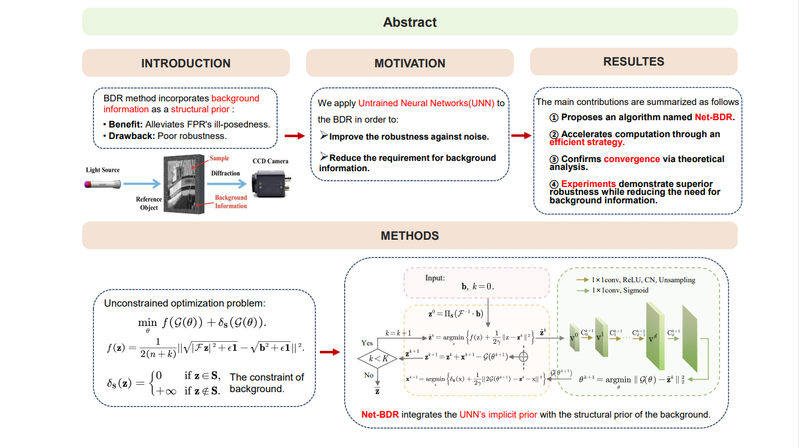

# Net-BDR: Untrained Neural Networks embedded Background Douglas Rachford method for Fourier Phase Retrieval

Official implementation of the paper accepted by **IEEE Transactions on Computational Imaging**.

## 📖 Introduction
Background Douglas-Rachford (BDR) methods incorporate background information as a structural prior to alleviate the ill-posedness of Fourier Phase Retrieval (FPR). However, traditional methods suffer from poor robustness. 

**Net-BDR** integrates the implicit prior of Untrained Neural Networks (UNN) with the structural prior of the background. Our method:
* **Improves robustness** against noise.
* **Reduces the requirement** for background information.
* **Accelerates computation** through an efficient strategy.

**DOI:** [10.1109/TCI.2026.3670621](https://doi.org/10.1109/TCI.2026.3670621)

## 🖼️ Framework


## 🚀 Getting Started

### Installation

```bash
git clone https://github.com/caffesugar/Net-BDR.git
cd Net-BDR
pip install -r requirements.txt
```

## 📝 Citation
If you find this code or our proposed Net-BDR framework useful in your research, please consider citing our paper:

```bibtex
@ARTICLE{11421092,
  author={Yang, Yi and Ma, Liyuan and Yuan, Ziyang and Wang, Hongxia},
  journal={IEEE Transactions on Computational Imaging}, 
  title={Net-BDR: Untrained Neural Networks Embedded Background Douglas Rachford Method for Fourier Phase Retrieval}, 
  year={2026},
  volume={12},
  number={},
  pages={673-688},
  keywords={Noise;Image reconstruction;Robustness;Neural networks;Convergence;Phase measurement;Imaging;Noise measurement;Loss measurement;Signal processing algorithms;Fourier phase retrieval (FPR);untrained neural networks;background information;Douglas Rachford method},
  doi={10.1109/TCI.2026.3670621}}
```

